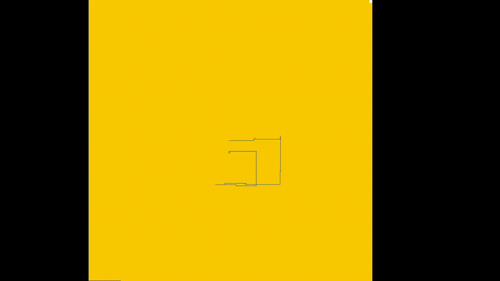

# Advent of Code 2020
Solving puzzles of AoC20, probably all with Python. 

Fourth year I'm joining this cool challenge. Goal is just to solve 
every puzzle within the day. Last year I focused on the use of Python and writing 
Pythonic code (check my other repos). 

This year I just solve the problems. Hopefully I can find the time
to complete it.

In this readme, just some notes about the puzzles, my code and other 
solutions I have seen. All solution can be found in this repository.

## [--- Day 1: Report Repair ---](https://adventofcode.com/2020/day/1)
Not much to see here.. really easy first puzzle today. The biggest 
challenge today was getting my wifi working. Unfortunately we got an
electrical issue by a short circuit somehwere in the house. Haven't 
figured it out. But managed to get on the internet for a couple of
minutes, which was enough to solve this one!

P1: out of a list of numbers, find the two numbers that sum to 2020.
P2: out of a list of numbers, find the three elements that sum to 2020.

Just created a list of possible combinations and checked them. The 
result came in directly. Easy..

But the guys from our AoC-slack-group came up with creative and optimal
solutions for part 1.

One was based on first sorting the list and using two counters (one
at the beginning of the list and one at the end). If the sum is bigger
than 2020, move the endcounter one to the left, if the sum is smaller
than 2020, move the begincounter one to the right (O(n\*log(n)). Credits
to Mario.

The other solution was to create a set of the numbers. Then iterate 
through the numbers and check if "2020-number" is in the set. Using a
set makes it cheap to get the element, which results in O(n) as time
complexity for part 1. Credits to [Chris](https://github.com/Chriskamphuis/aoc2020).

## [--- Day 2: Password Philosophy ---](https://adventofcode.com/2020/day/2)
Easy puzzle today again. I guess even less discussion about complexity
than day 1. Input are a list of password, including a two numbers and a letter.

P1: count frequency of a given letter in password and see if it falls within
a given range (the two numbers)
P2: Use the two numbers as indexes and check if exactly one of those places
contain the given letter.

I do both parts in one go. In a line by line loop I first parse the input 
(I just used split() and map)) then check the frequency of the given letter
in the password and if it is in the given range. Next I do the XOR (in Python
you can use `^` or `!=`) check for the positions. 

You could add try/catch stuff for the indexing of the passwords to be failsafe
and you could bail out early when the frequency is hihger than the high limit
of the range for some optimization, but that's about it I guess!

## [--- Day 3: Toboggan Trajectory ---](https://adventofcode.com/2020/day/3)
A typical AoC puzzle, which I really like. You get a sort of topdown map as
input and need to map out a trajectory and see what is in the way of the
trajectory. This time there are trees on a slope and you want to select the
best route with your toboggan, based on the trees you can avoid on the slope.

The map repeats itself in horizontal direction. You only have to store the
object locations which you can hit or need to count (in this specific case,
only the trees) and the toboggan just moves linear according to some given
slope. This makes it easy to check which trees the toboggan hits in its 
trajectory on the slope.

No problems solving this one, but I liked it. And every year I try to make
some fun visualisations in the basic commandprompt/terminal. So this was a
nice opportunity to create one!

## [--- Day 4: Passport Processing ---](https://adventofcode.com/2020/day/4)
Today a bit more elbow grease: validation of passport fields. This could for
a part done with regexes, but I could not manage to put it all in a regex.
I used a dictionary with the passport fields as keys and as values function
pointers or lambda functions if they were short.

I did found out that python dictionaries are ordered since python 3.7 and 
that I found the wallrus operator useful (but it's only from 3.8!).

In the meantime I check out some old 2015/2016 puzzles. I participated and
completed 2017/2018/2019, so I want to have those stars ;)

Let's head into the weekend!

## [--- Day 5: Binary Boarding ---](https://adventofcode.com/2020/day/5)
I expected a bigger puzzle in the weekend, but this one was still easy
to manage. This puzzle contained some cryptic boardingpasses, from which
you could infer the seatnumber by using binary space partitioning. I just
implemented what has been asked and it worked fine.

Apparantly you could have cut some corners by inferring it had something
to do with binary and you could make the translation directly. I wouldn't
come up with that, so I'm happy with my own solution. It was quick and clear
for myself what needed to be done, but I should look into that binary stuff.

For part 2 you should look in the list of seatnumbers, which one was missing.
First you can sort this and then look of the numbers are all (previous + 1).
Not a big deal!

## [--- Day 6: Custom Customs ---](https://adventofcode.com/2020/day/6)
Sunday, again expecting a bigger puzzle. Today in the plane, all groups of
people needed to answer a questionnaire and you need to find out which 
groups all answered "yes" to the same question. No optimazation needed and
just some straight forward looping through these records did the job.

This first week has been nice. Small puzzles that didn't take too much
time and some days resulted in good discussions about the solutions.

Everyone's still on board!

Because I like making some simple visualisations in the terminal/command
prompt, I have the idea to experiment with the python module *curses*,
which gives you an interface to draw directly on the terminal, without
difficult alignment and refreshing problems. Should be fun!

## [--- Day 7: Handy Haversacks ---](https://adventofcode.com/2020/day/7)
To carry your luggage you need to apply to the luggage rules of aviation.
Specific colored bags can contain specific other colored bags. What options
do you have as "outerbag" for your shiny gold bag?

So this kind of puzzle is typical for AoC. If you create a graph from the
rules, you can apply some graph algorithms on this data.

I went the recursive way and when it worked I didn't want to revisit it
anymore. I just experimented some with regexes instead of splitting strings.
Works fine for a lot of usecases, makes code maybe a bit shorter, but
I still like the transparant way you can use string operations in Python
to parse inputfiles.

## [--- Day 8: Handheld Halting ---](https://adventofcode.com/2020/day/8)
Oh, no. The handheld device (gameboy?) stopped working from the kid next
to you in the plan. Of course it runs some intcode (flashbacks to last 
year).

So, is this our first step to a new intcomputer? Anyone who participated
last year knows how important it was to make their intcomputer reusable
and easy to expand. I think I'll revisit my code later today, to check
if I can make it "better" and add some testcases or something. But it 
would be fun if everyone spends time to make this intcomputer perfect,
and this year we won't use it in later days ;-)

## [--- Day 9: Encoding Error ---](https://adventofcode.com/2020/day/9)
Should use a sliding window. Just did some "smart" trick which is fast for
my input, but won't work for all cases (so a bad solution!)

## [--- Day 10: Adapter Array ---](https://adventofcode.com/2020/day/10)
Used recursion with manual caching (memoization) and later refactored it
with lru_cache for simplicity. Tribonacci sequence apparantly!

## [--- Day 11: Seating System ---](https://adventofcode.com/2020/day/11)
Game of Life simulation. Added some lookup/cache again to make it 10 times 
faster as my initial solution was.

## [--- Day 12: Rain Risk ---](https://adventofcode.com/2020/day/12)
Nice simple day, to let the ship follow a waypoint. That allowed for a small
mondriaan inspired visual!

## [--- Day 13: Shuttle Search ---](https://adventofcode.com/2020/day/13)
Toughest day so far. Didn't manage to bring enough math theory to solve this in 
one go (something with CRT; Chinese Remainder Theorem). So I had to make my own
solution, which took me very long. But after a stroll around the forest, I came
back, debugged my algorithm and finished it up, finally..!

## [--- Day 14: Docking Data ---](https://adventofcode.com/2020/day/14)
Doing some stuff with bitmasks. Easy day, after struggle sunday. I didn't even do 
anything with "real" bitmasks, which would be quite nice with OR/AND. First I had both
parts splitted. But I decided to refactor it to one loop. That resulted in a bigger
mess, but I don't feel like reverting it anymore..

## [--- Day 15: Rambunctious Recitation ---](https://adventofcode.com/2020/day/15)
The elves play a memory game and try to remember if a number is already spoken.
The last to times the number occured are subtracted and is the new number.
I just placed the last 2 occurences in a dictionary and let the script do the 
work. For part 1 it was easy and I didn't thought it would work for part 2 (which)
involved a lot more looping and memory usage, but it turned out to work.
No smart solution, but in two minutes it was done.. Slow, but now I can get to work.
Let's see what the others come up with.

## [--- Day 16: Ticket Translation ---](https://adventofcode.com/2020/day/16)
Find out which rules apply to which column by deducing from valid examples.
Messy long solution, but runs in 15ms, so fine and no time for refactoring!

## [--- Day 17: Conway Cubes ---](https://adventofcode.com/2020/day/17)
Again some kind of Game of Life simulation, only with 3 dimensions for the first
part and four dimensions for the second part. Also the size of every dimension 
can grow by the rules, so you need to manage that. I like a dictionary in Python
for these kind of tasks, sometimes a defaultdict is preferred, but for this one
I can manage the bounds more easily with a normal dict. Again happy to take the 
stars today with very little sleep. Hopefully I can manage to keep it up till
the 25th. 

## [--- Day 18: Operation Order ---](https://adventofcode.com/2020/day/18)
For part 1 a couple of equations needed to be solved with multiplications,
summations and brackets. But not the "normal" rules of precedence apply.
So I just parsed it myself and also accounted for numbers bigger than 9,
turned out I didn't need that and I overcomplicated the flow because of
that, which put me off for the next part. In this second part the precedence
of the operators is swapped (so add evaluates first instead of multiply).
First I tried to add brackets, but somehow it didn't work with my code of
part 1. Time to try something different: it  would be a very easy assignment 
if we could change this precedence somehow and throw in in Python's "eval".
So I made a dummy class for integers and abused the build in dunder methods
and did some find and replace in the gives equations and voila! Easy and 
simple. Also changed part 1 to this method. Magic!

## [--- Day 19: Monster Messages ---](https://adventofcode.com/2020/day/19)
Wow first first gold star of our private leaderboard this year, didn't thought 
that would happen with ahans and willi :wink: Probably all sleeping in the weekend, 
but a first is a first.
Not very pythonic code, a bit long for my taste, but it works and I'm happy enough 
to solve it without optimzing or refactoring. Runs in 3 seconds.
Created a regex on the go. For part 2 I tried to come up with one regex, but you have 
some dependancy between two groups (that need to be the same amount of occurences) and 
couldn't figure out how to do that with a single regex, so just made a loop which 
replaces those group quantifiers with a counter.
Turns out to be a quite nice and straightforward solution compared to other solutions.

## [--- Day 20: Jurassic Jigsaw ---](https://adventofcode.com/2020/day/20)
Last sunday of AoC. In most cases the weekend puzzles are bigger and this one
is really big and confusing.
Unfortunately I got sick saterdayevening and I couldn't make it to my laptop
for this puzzle, but read about the tricky puzzle and the time some guys spend
on this one.. I have to catch up with this day later this week.

## [--- Day 21: Allergen Assessment ---](https://adventofcode.com/2020/day/21)
After reading the puzzle on my phone, I decided this was an easy puzzle to do.
It was kinda similar to day 16, but even more easy. Maybe I need to do some
thinking on Day 20 already, because I want to finish it before christmas.
I'm already feeling better, so hopefully I'm back alive tomorrow.

## [--- Day 22: Crab Combat ---](https://adventofcode.com/2020/day/22)
Implement the game of war (or "hoger/lager"?) and make it kind of recurse
in the second part. No weird things this day, only there were some
requirements which did not appear in all outputs, which made it easier for
some people to get it right the first time and quicker to run.

## [--- Day 23: Crab Cups ---](https://adventofcode.com/2020/day/23)
Again some crab game. No with a big cyclic list where you needed to remove 
sublists and adding them again somewhere else. The trick here was to think
of a datastructure or something to keep this manageable and fast to run for
10 million iterations. So you could use some kind of linklist (or integer 
array) or just a dict.

Best thing of today: I found time to solve day 20! Found 19 seamonsters with
my monstercode. Happy to finish that one! Took a long time to found a bug in 
my assemblage of the puzzle. Didn't flip the righttop piece. After I figured
that out when I was not even behind my computer, it worked. Yeah!

## [--- Day 24: Lobby Layout ---](https://adventofcode.com/2020/day/24)
Third Game of Life simulation! We learn from the past times, and this time
I'm just keeping a set coordinates of elements which are "on", loop over 
them and check their possible neighbours too. No need to keep a real grid
of elements. Fast!

## [--- Day 25: Combo Breaker ---](https://adventofcode.com/2020/day/25)
Last day. An easy occlusion, just doing some operations to the input numbers
and voila! You finally reached your holiday location.

## --- SUMMARY ---
I really liked the overall difficulty of the puzzle of this year.
In my opinion there weren't the really difficult puzzles like last
year, which were near to impossible to finish in a reasonable time.
Only two days that were hard were day 13 and day 20. But not because
you couldn't solve it without weird math tricks, but because you had
to figure a lot out and debugging was hard for these assignments.

There weren't real dependancies between puzzles, which I think isn't
a disadvantage for these kind of challenges. Last year with the intComputer
some people got discouraged in later days and quit because of their
messy implementation.

A great edition of AoC!